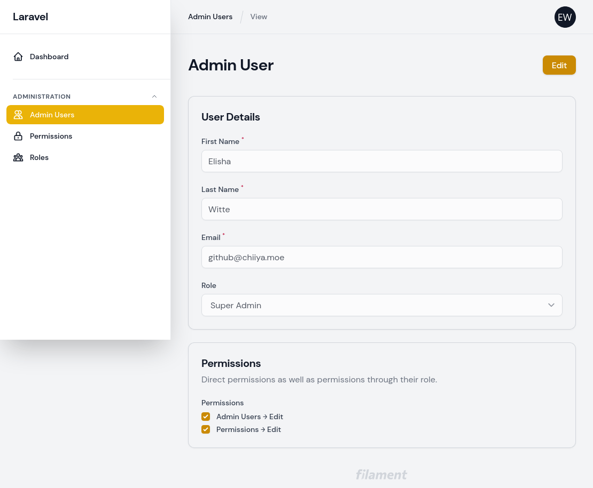
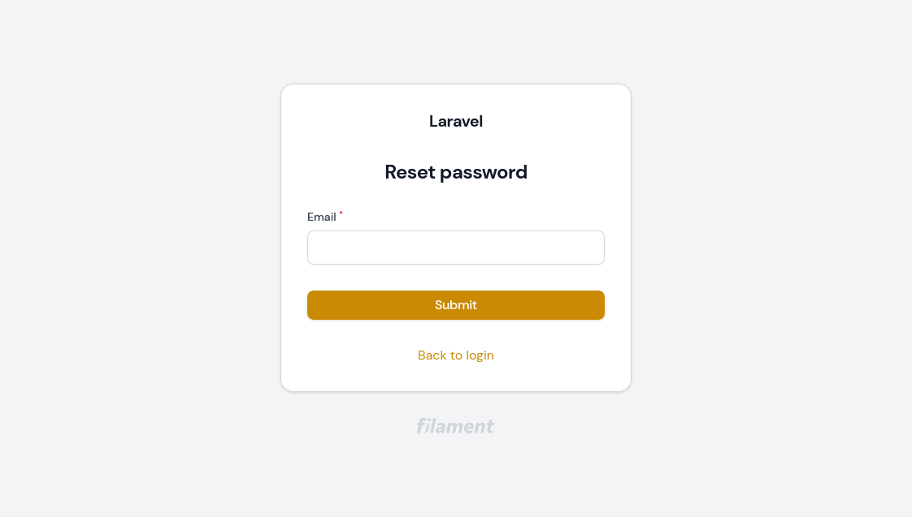
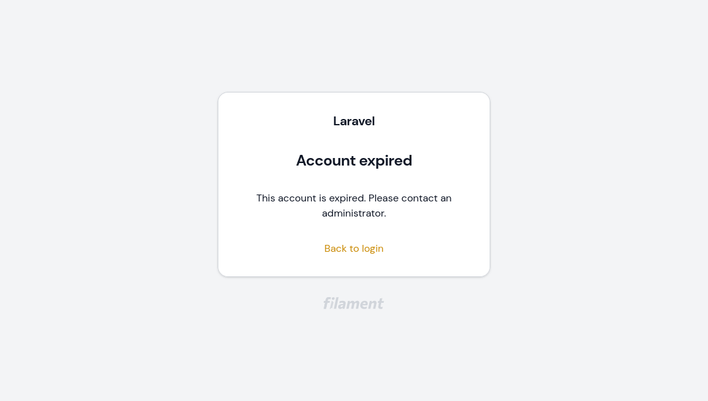
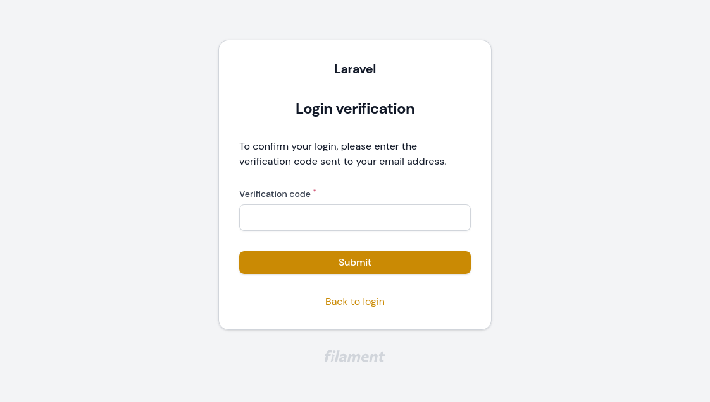

# Filament Access Control

[](https://packagist.org/packages/chiiya/filament-access-control)
[](https://github.com/chiiya/filament-access-control/actions?query=workflow%3Alint+branch%3Amaster)
[](https://packagist.org/packages/chiiya/filament-access-control)

Opinionated setup for managing admin users, roles and permissions within [Laravel Filament](https://github.com/laravel-filament/filament)

## Features
- Separate database table for filament admin users (separate model, separate guard, separate password broker)
- Uses [spatie/laravel-permission](https://github.com/spatie/laravel-permission) for roles and permissions
- Adds the missing password reset flow to Filament
- Fully localized
- CRUD resources for admin users, roles and permissions
- Admin users _may_ belong to **one** role
- Admin users can have direct permissions or indirect permissions through their role
- When creating admin users through the admin interface, no password is specified. Instead, the user receives an email prompting them to set their password
- Optional account expiry for admin users. Expired accounts are no longer able to log in
- Optional email based two-factor authentication.

## Installation

1. Install the package via composer:

```bash
composer require chiiya/filament-access-control
```

2. Update your `config/filament.php` file to use the package's guard and `Login` page:

```php
'auth' => [
    'guard' => env('FILAMENT_AUTH_GUARD', 'filament'),
    'pages' => [
        'login' => \Chiiya\FilamentAccessControl\Http\Livewire\Login::class,
    ],
],
```

3. Publish the migrations and config, then run the migrations. Make sure you also publish 
and run the [spatie/laravel-permission](https://github.com/spatie/laravel-permission) migrations
if you haven't done so yet.

```bash
php artisan vendor:publish --tag="filament-access-control-migrations"
php artisan vendor:publish --tag="filament-access-control-config"
php artisan vendor:publish --provider="Spatie\Permission\PermissionServiceProvider"
php artisan migrate
```

4. To seed the necessary base data (role & permissions), run `php artisan filament-access-control:install`
or call the `Chiiya\FilamentAccessControl\Database\Seeders\FilamentAccessControlSeeder` seeder in your database seeder.

5. Create an admin user using `php artisan filament-access-control:user`. If you create users programmatically
(e.g. in your database seeder), make sure to assign them the `super-admin` role if you want them to be able to 
access the role and user management.

Optionally, you can publish the translations with:

```bash
php artisan vendor:publish --tag="filament-access-control-translations"
```

Optionally, you can publish the views with:

```bash
php artisan vendor:publish --tag="filament-access-control-views"
```

## Usage

### Authorizing Resources, Pages & Actions

#### Authorizing Resources
To authorize access to resources, use policies as described in the 
[Filament documentation](https://filamentphp.com/docs/2.x/admin/resources#authorization).

```php
class ProductPolicy
{
    public function viewAny(FilamentUser $user): bool
    {
        return $user->can('products.view');
    }
    
    // ...
}
```

#### Authorizing Pages
This package comes with a simple trait that you can use to authorize access to custom
pages based on a permission.

```php
use Chiiya\FilamentAccessControl\Traits\AuthorizesPageAccess;

class MyPage extends Page
{
    use AuthorizesPageAccess;
    
    public static string $permission = 'my-page.view';
    
    public function mount(): void
    {
        static::authorizePageAccess();
    }
}
```

#### Authorizing Actions
One way to authorize actions is to use the `visible()` method:

```php
ButtonAction::make('exports')
    ->visible(fn () => Filament::auth()->user()->can('exports.view'))
```

### Localizing Role & Permission Names
Roles and permissions should have names that make them easy to use in code (e.g. `admin-users.update`).
For the admin you may however wish to localize them or make them more readable. You can do so by simply
adding a JSON translation entry for the given role or permission name (e.g. `lang/en.json`):

```json
{
    "admin-users.update": "Admin Users → Edit"
}
```

### Feature: Account Expiry
With the optional account expiry feature, all accounts require an expiration date. When 
accounts are expired, they can no longer log in. To enable the account expiry feature, 
enable the feature flag in the config file:

```php
'features' => [
    \Chiiya\FilamentAccessControl\Enumerators\Feature::ACCOUNT_EXPIRY,
],
```

You will also need to add the `EnsureAccountIsNotExpired` middleware to your filament auth middleware config:

```php
use Chiiya\FilamentAccessControl\Http\Middleware\EnsureAccountIsNotExpired;

'middleware' => [
    'auth' => [
        Authenticate::class,
        EnsureAccountIsNotExpired::class,
    ],
]
```

### Feature: Two-Factor Authentication
With the optional two-factor authentication feature, users must enter a verification code sent
via email upon login. To enable the two-factor authentication feature, enable the feature
flag in the config file:

```php
'features' => [
    \Chiiya\FilamentAccessControl\Enumerators\Feature::TWO_FACTOR,
],
```

### Custom User Model
To use your own custom user model for the admin (instead of `Chiiya\FilamentAccessControl\Models\FilamentUser`),
point the value of `user_model` in the `filament-access-control` config file to your own model.

```php
'user_model' => CustomFilamentUser::class,
```

Please make sure that your model either extends the `FilamentUser` base case or implements the 
`Chiiya\FilamentAccessControl\Contracts\AccessControlUser` interface.

```php
use Chiiya\FilamentAccessControl\Models\FilamentUser;
use Chiiya\FilamentAccessControl\Contracts\AccessControlUser;
use Filament\Models\Contracts\FilamentUser as FilamentUserInterface;
use Filament\Models\Contracts\HasName;
use Illuminate\Foundation\Auth\User as Authenticatable;

class CustomFilamentUser extends FilamentUser
{
    // ...
}

// Or alternatively
class CustomFilamentUser extends Authenticatable implements AccessControlUser, FilamentUserInterface, HasName
{
    // ...
}
```

## Screenshots






## Changelog

Please see [CHANGELOG](CHANGELOG.md) for more information on what has changed recently.

## Contributing

Please see [CONTRIBUTING](.github/CONTRIBUTING.md) for details.

## License

The MIT License (MIT). Please see [License File](LICENSE.md) for more information.
