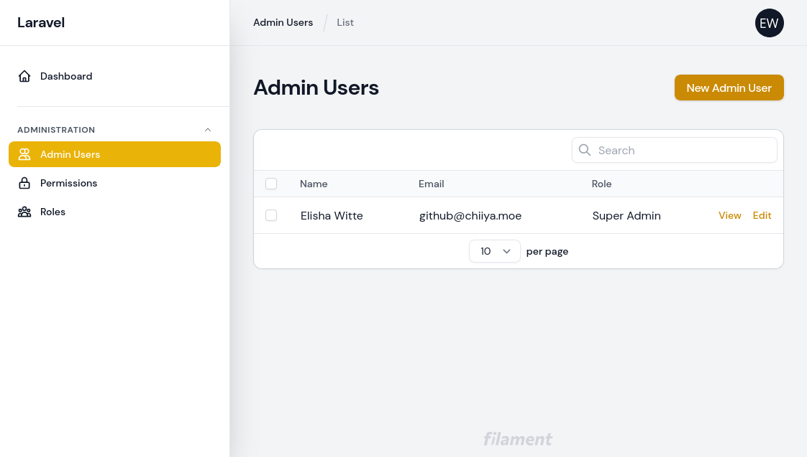
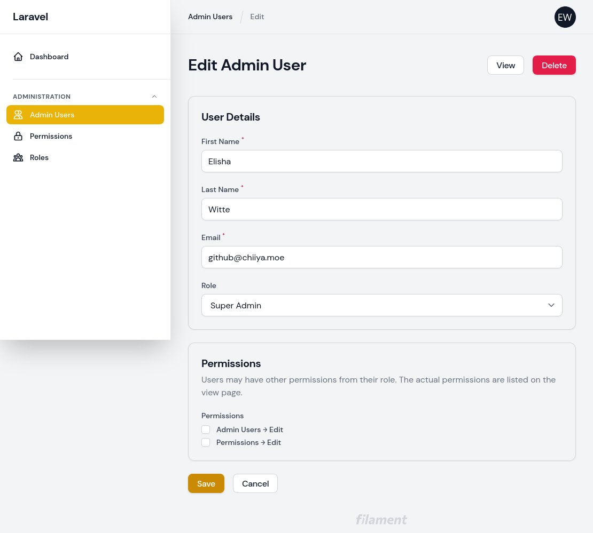

<p align="center">
    
</p>

# Filament Access Control

[](https://packagist.org/packages/chiiya/filament-access-control)
[](https://github.com/chiiya/filament-access-control/actions?query=workflow%3A"Lint"+branch%3Amaster)
[](https://packagist.org/packages/chiiya/filament-access-control)

Opinionated setup for managing admin users, roles and permissions within [Laravel Filament](https://github.com/laravel-filament/filament)

## Features
- Separate database table for filament admin users (separate model, separate guard, separate password broker)
- Uses [spatie/laravel-permission](https://github.com/spatie/laravel-permission) for roles and permissions
- Adds the missing password reset flow to Filament
- Fully localized
- CRUD resources for admin users, roles and permissions
- Admin users _may_ belong to **one** role
- Admin users can have direct permissions or indirect permissions through their role
- When creating admin users through the admin interface, no password is specified. Instead, the user receives an email prompting them to set their password
- Optional account expiry for admin users. Expired accounts are no longer able to log in

## Installation

1. Install the package via composer:

```bash
composer require chiiya/filament-access-control
```

2. Update your `config/filament.php` file to use the package's guard and `Login` page:

```php
'auth' => [
    'guard' => env('FILAMENT_AUTH_GUARD', 'filament'),
    'pages' => [
        'login' => \Chiiya\FilamentAccessControl\Http\Livewire\Login::class,
    ],
],
```

3. To seed necessary data (base role & permissions) call the package seeder in your database seeder, or manually
using `php artisan db:seed --class="Chiiya\\\FilamentAccessControl\\\Database\\\Seeders\\\FilamentAccessControlSeeder"`:

```php
use Chiiya\FilamentAccessControl\Database\Seeders\FilamentAccessControlSeeder;

public function run()
{
    $this->call(FilamentAccessControlSeeder::class);
}
```

You can publish and run the migrations with:

```bash
php artisan vendor:publish --tag="filament-access-control-migrations"
php artisan migrate
```

Make sure you also publish the [spatie/laravel-permission](https://github.com/spatie/laravel-permission) migrations
if you haven't done so yet:

```bash
php artisan vendor:publish --provider="Spatie\Permission\PermissionServiceProvider"
```

You can publish the config file with:

```bash
php artisan vendor:publish --tag="filament-access-control-config"
```

Optionally, you can publish the translations with:

```bash
php artisan vendor:publish --tag="filament-access-control-translations"
```

Optionally, you can publish the views with:

```bash
php artisan vendor:publish --tag="filament-access-control-views"
```

## Usage

### Localizing Role & Permission Names
Roles and permissions should have names that make them easy to use in code (e.g. `admin-users.update`).
For the admin you may however wish to localize them or make them more readable. You can do so by simply
adding a JSON translation entry for the given role or permission name (e.g. `lang/en.json`):

```json
{
    "admin-users.update": "Admin Users → Edit"
}
```

### Feature: Account Expiry
With the optional account expiry feature, all accounts require an expiration date. When 
accounts are expired, they can no longer log in. To enable the account expiry feature, 
enable the feature flag in the config file:

```php
'features' => [
    \Chiiya\FilamentAccessControl\Enumerators\Feature::ACCOUNT_EXPIRY,
],
```

You will also need to add the `EnsureAccountIsNotExpired` middleware to your filament auth middleware config:

```php
use Chiiya\FilamentAccessControl\Http\Middleware\EnsureAccountIsNotExpired;

'middleware' => [
    'auth' => [
        Authenticate::class,
        EnsureAccountIsNotExpired::class,
    ],
]
```

## Screenshots






## Changelog

Please see [CHANGELOG](CHANGELOG.md) for more information on what has changed recently.

## Contributing

Please see [CONTRIBUTING](.github/CONTRIBUTING.md) for details.

## License

The MIT License (MIT). Please see [License File](LICENSE.md) for more information.

## Roadmap

- [ ] Add optional 2-factor authentication
